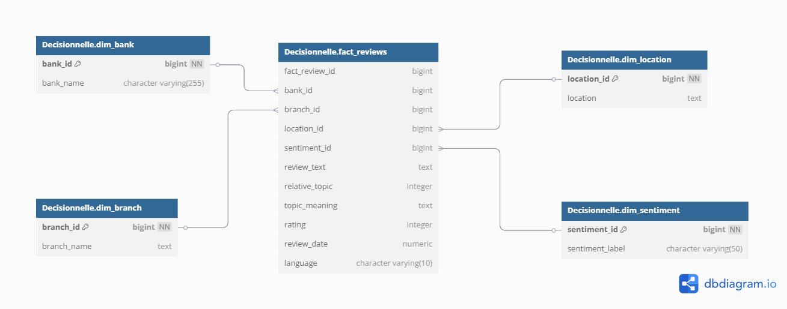
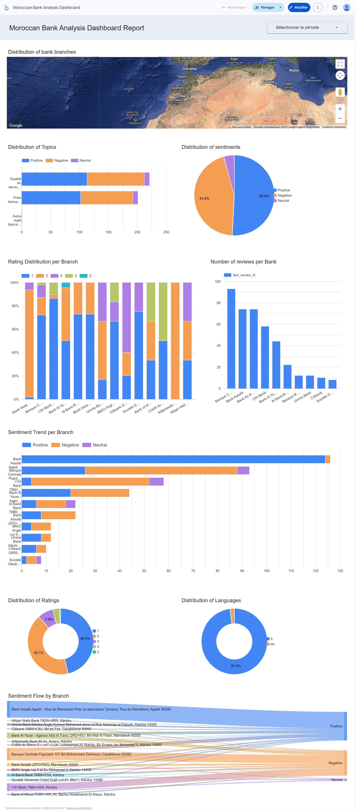
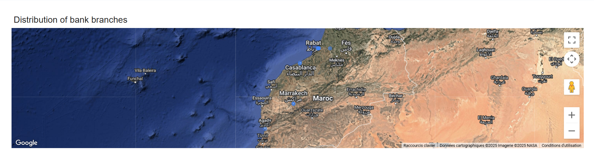
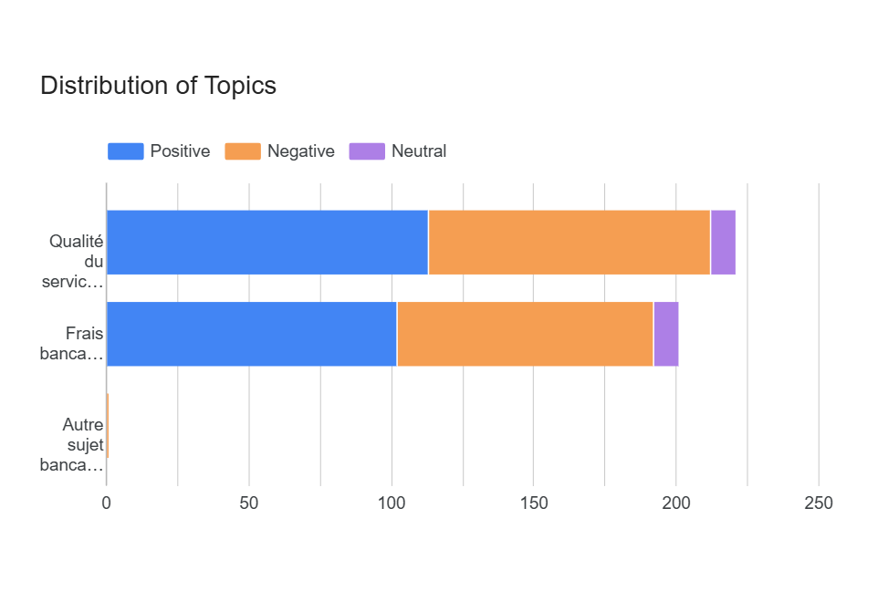
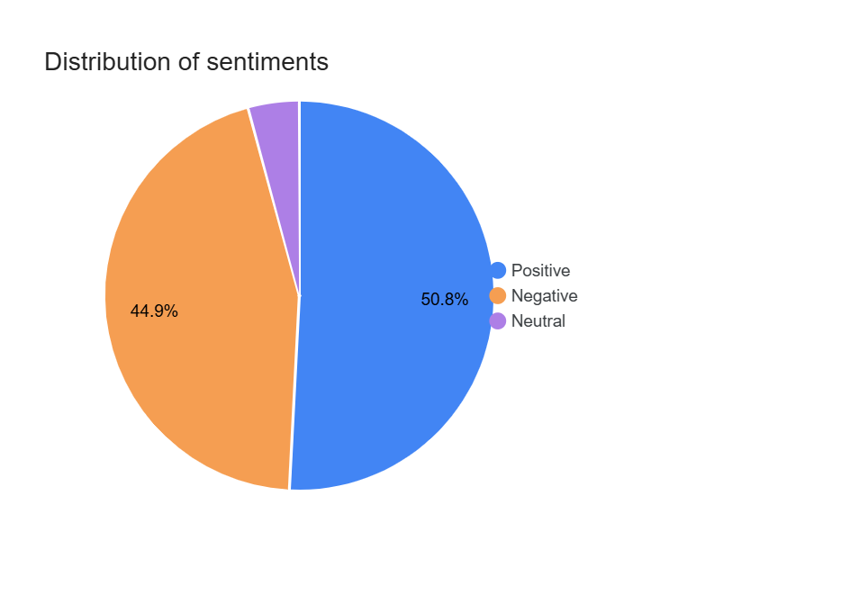
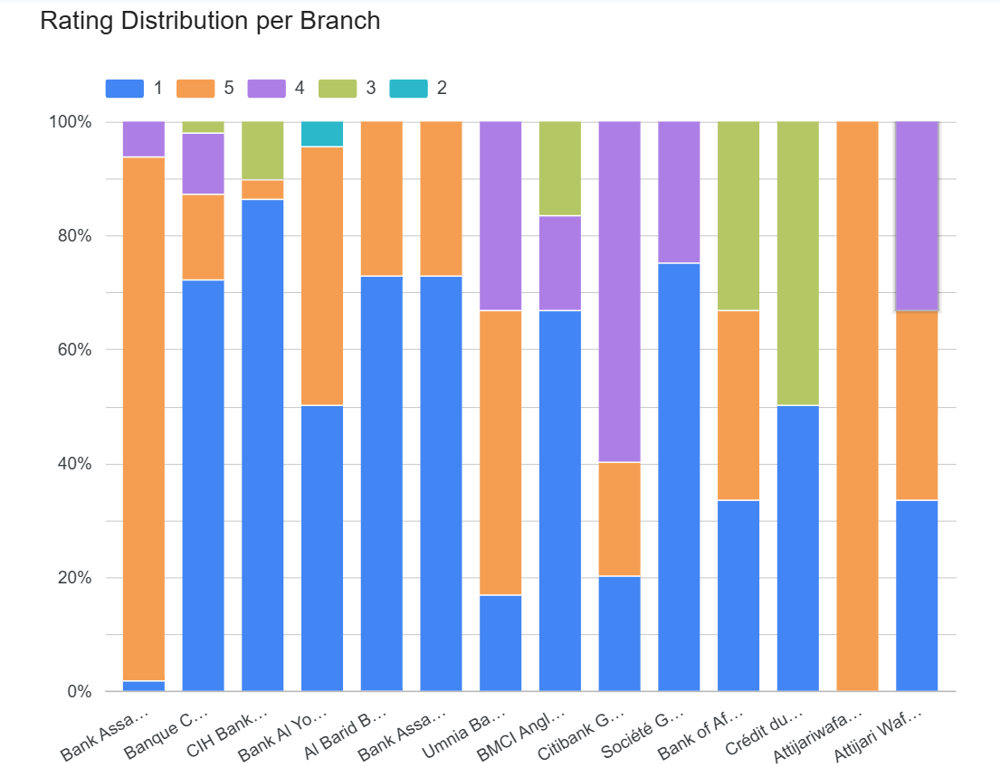
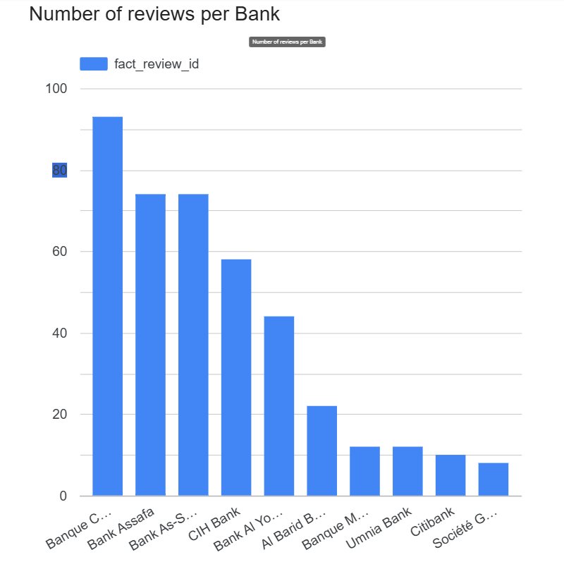
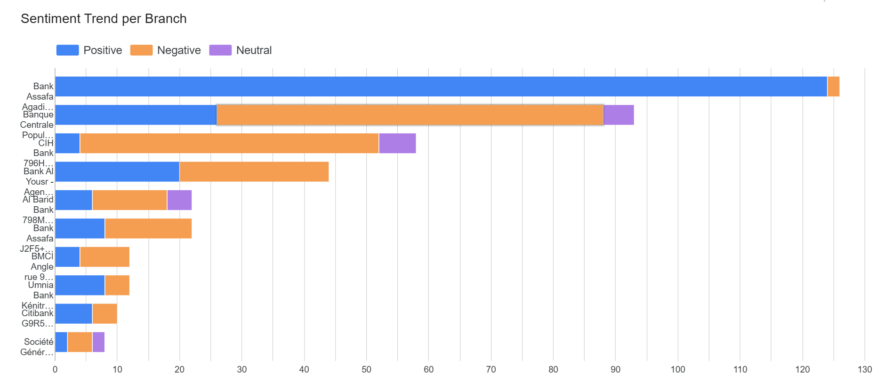
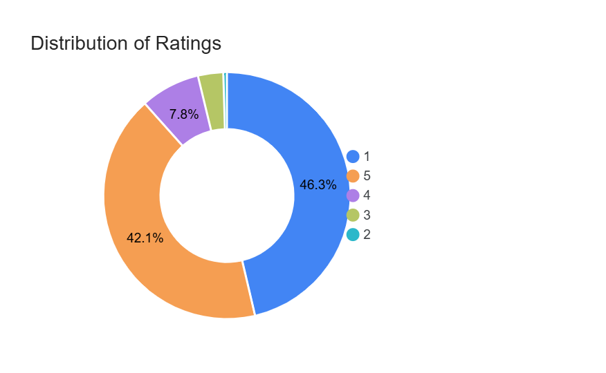
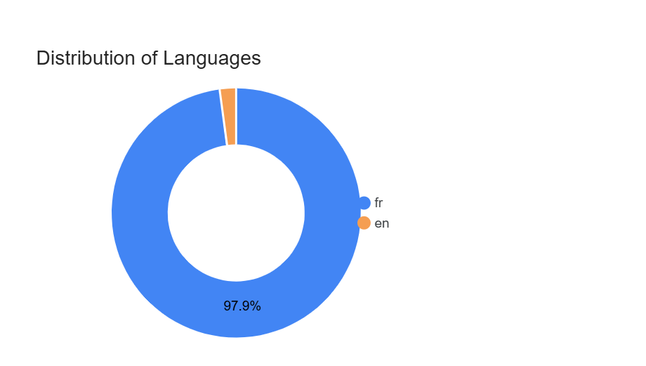

# Analyzing Customer Reviews of Bank Agencies in Morocco using a Modern Data Stack

## Student Profile
**Name:** NOURDDINE Othmane <br />
**Program:** Master 2 – Systèmes d'Information et Systèmes Intelligents (M2SI) <br />
**Institution:** Institut National de Statistique et d'Économie Appliquée (INSEA) <br />
**Academic Year:** 2024-2025 <br />
**Project Type:** Data Engineering & Analytics Capstone Project <br />

## Project Overview

**Objective:**
Collect, process, and analyze Google Maps reviews for bank agencies in Morocco to extract valuable insights using topic modeling, sentiment detection, and other key metrics. Build a fully operational data pipeline using modern tools for efficient data extraction, transformation, storage, and visualization.

## Table of Contents

1. [Project Overview](#project-overview)
2. [Project Scope](#project-scope)
3. [Technology Stack](#technology-stack)
4. [Project Roadmap](#project-roadmap)
5. [Deliverables](#deliverables)

---

## Project Scope

Banks receive thousands of customer reviews on Google Maps. These reviews contain valuable insights about customer satisfaction, service quality, and common issues, but they are unstructured and dispersed. This project centralizes, cleans, and analyzes these reviews to provide actionable insights.

**Expected Insights:**

* **Sentiment Analysis:** Trends in customer satisfaction over time.
* **Topic Modeling:** Common praise points and recurring issues.
* **Branch Performance:** Ranking of bank agencies based on aggregate sentiment.
* **Customer Experience Metrics:** Identification of frequent complaints and satisfaction drivers.

---

## Technology Stack

| Stage               | Technology                                    |
| ------------------- | --------------------------------------------- |
| **Data Collection** | Python, Google Maps API, BeautifulSoup/Scrapy |
| **Scheduling**      | Apache Airflow                                |
| **Data Storage**    | PostgreSQL (Data Warehouse)                   |
| **Transformation**  | DBT (Data Build Tool)                         |
| **Analysis & BI**   | Looker Studio (Google Data Studio)            |
| **Version Control** | GitHub                                        |

## Folder Structure

📁 Project Root 
├── 📁 .dbt/                          # DBT configuration files
├── 📁 airflow/                       # Airflow orchestration
│   ├── 📁 dags/                      # DAG definitions
├── 📁 Dashboard_images/              # Dashboard screenshots
├── 📁 data_warehouse_project/        # DBT project
│   ├── 📁 analyses/                  # Ad-hoc analyses
│   ├── 📁 logs/                      # DBT logs
│   ├── 📁 macros/                    # DBT macros
│   ├── 📁 models/                    # DBT models
│   │   ├── 📁 marts/                 # Data mart models
│   │   └── 📁 sources/               # Source definitions
│   ├── 📁 seeds/                     # Static data files
│   ├── 📁 snapshots/                 # Data snapshots
│   ├── 📁 target/                    # DBT compiled files
│   │   ├── 📁 compiled/              # Compiled SQL
│   │   └── 📁 run/                   # Execution results
│   └── 📁 tests/                     # Data quality tests
└── 📄 README.md                      # Project documentation


## Project Roadmap

The project is structured into six main phases:

### Phase 1: Data Collection (✅ Completed)

1. **Extract Reviews:**

   * Use Google Maps API or web scraping to collect reviews for major bank agencies in Morocco.
   * Capture: Bank name, branch name, location, review text, rating, review date.
   * Save raw data in JSON/CSV files.
2. **Automation with Airflow:**

   * Configure an Airflow DAG to schedule data extraction daily or weekly.
   * Load raw data into a PostgreSQL staging table.

### Phase 2: Data Cleaning & Transformation (✅ Completed)

1. **Cleaning (DBT & SQL):**

   * Deduplicate records.
   * Normalize text (lowercase, remove punctuation & stop words).
   * Handle missing or null values.
2. **Enrichment:**

   * Detect language of each review.
   * Classify sentiment as *Positive*, *Negative*, or *Neutral*.
   * Perform topic extraction using LDA for common themes.

### Phase 3: Data Modeling (✅ Completed)

1. **Star Schema Design:**

   * **Fact Table:** `fact_reviews` (metrics per review).
   * **Dimension Tables:** `dim_bank`, `dim_branch`, `dim_location`, `dim_sentiment`.
2. **Implementation:**

   * Build DBT models to transform and load data into the warehouse.
   * Automate loading via Airflow DAGs.


### Phase 4: Data Analytics & Reporting (✅ Completed)

* Develop interactive dashboards in Looker Studio:

  * Sentiment trends by bank and branch.
  * Top positive and negative topics.
  * Branch performance rankings.
  * Key customer experience insights.

### Phase 5: Deployment & Automation

1. **Pipeline Automation:**

   * Ensure Airflow DAGs run on schedule (daily/weekly updates).
   * Configure alerts for data failures or anomalies.

---

## Deliverables

### Phase 1: Data Collection & Loading

1. **main\_scraping\_script.py**

   * **Rôle :** Script principal de collecte des avis Google Maps pour une liste de banques marocaines.
   * **Technologies :** Python 3, Selenium, BeautifulSoup4, webdriver-manager, Chrome.
   * **Fonctionnalités clés :**

     * Initialisation et configuration du driver Chrome.
     * Navigation et défilement dynamiques pour charger tous les avis.
     * Extraction des liens d’agences, noms, adresses et avis (texte, note, date).
     * Contrôles d’erreur et pauses aléatoires pour limiter la détection.
   * **Entrée / Sortie :**

     * Liste de banques en dur dans le script.
     * Génération de `moroccan_banks_reviews.json` dans `~/input/data_of_json_google_map/`.

2. **insert\_data.py**

   * **Rôle :** Chargement du JSON brut dans la table `staging` PostgreSQL.
   * **Technologies :** Python 3, psycopg2.
   * **Fonctionnalités clés :**

     * Création/rafraîchissement de la table `staging`.
     * Parsing du JSON de scraping.
     * Insertion des champs (banque, agence, emplacement, texte d’avis, note, date) avec date de scraping.
     * Gestion des erreurs de connexion, décodage JSON et insertion, rollback en cas d’erreur.

**Orchestration Airflow (Phase 1)**

```python
scraping_task = PythonOperator(
    task_id='extract_data_task',
    python_callable=lambda: __import__('main_scraping_script').main(),
    dag=dag
)
insertion_task = PythonOperator(
    task_id='insert_data_task',
    python_callable=lambda: __import__('insert_data').main(),
    dag=dag
)
scraping_task >> insertion_task
```

### Phase 2: Data Cleaning & Transformation

1. **cleaned\_reviews.sql**

   * **Rôle :** Modèle DBT de nettoyage et normalisation des données issues de `staging`.
   * **Étapes clés :** suppression des doublons, normalisation du texte (minuscules, suppression des caractères spéciaux), gestion des valeurs manquantes, détection/filtrage des langues (FR/EN), conversion des notes en entiers, ajustement des dates relatives via le macro `convert_relative_date`.

2. **sources.yml**

   * **Rôle :** Définition de la source `raw_data.staging` pour DBT.

3. **transform\_phase\_2.py**

   * **Rôle :** Enrichissement de la table `cleaned_reviews` avec détection de la langue, analyse de sentiments et modélisation de sujets via LDA.
   * **Technologies :** Python 3, pandas, SQLAlchemy, psycopg2, transformers, langdetect, NLTK, gensim.
   * **Fonctionnalités clés :** ajout de colonnes `language`, `sentiment`, `relative_topic`, `topic_meaning`, filtrage des avis contenants du script arabe, mise à jour incrémentale des données.

**Orchestration Airflow (Phase 2)**

```python
transform_phase_1_task = BashOperator(
    task_id='transform_phase_1_task',
    bash_command='cd ~/data_warehouse_project && dbt run --models cleaned_reviews',
    dag=dag
)
transform_phase_2_task = PythonOperator(
    task_id='transform_phase_2_task',
    python_callable=lambda: __import__('transform_phase_2').main(),
    dag=dag
)
transform_phase_1_task >> transform_phase_2_task
```

### Phase 3: Data Modeling

1. **dim\_bank.sql**, **dim\_branch.sql**, **dim\_location.sql**, **dim\_sentiment.sql**

   * **Rôle :** Création des tables de dimensions (`bank_id`, `branch_id`, `location_id`, `sentiment_id`) avec clés primaires et données distinctes provenant de `cleaned_reviews`.

2. **fact\_reviews.sql**

   * **Rôle :** Construction de la table de faits `fact_reviews` via jointures sur les dimensions, génération de la clé `fact_review_id` et définition des clés étrangères.

3. **profiles.yml**

   * **Rôle :** Configuration des connexions DBT pour les schémas `public` (raw & transformations) et `Decisionnelle` (Data Mart).

**Orchestration Airflow (Phase 3)**

```python
load_phase_task = BashOperator(
    task_id='load_phase_task',
    bash_command='cd ~/data_warehouse_project && dbt run --profile decisionnelle_profile --models dim_bank dim_branch dim_location dim_sentiment fact_reviews',
    dag=dag
)
transform_phase_2_task >> load_phase_task
```

Star Schema Diagram

Below is the star schema design for the data mart, showing the central fact table and its relationships to dimension tables:



Explanation: The fact_reviews table sits at the center, linking to four dimensions:

dim_bank: Contains unique banks (bank_id, bank_name).

dim_branch: Contains branches (branch_id, branch_name).

dim_location: Geographic information (location_id, location).

dim_sentiment: Sentiment labels (sentiment_id, sentiment_label).

This design enables efficient slicing and dicing of review data by bank, branch, location, or sentiment for BI queries.   

### Phase 4: Data Analytics & Reporting


1. Distribution des agences bancaires : Cette carte montre la répartition géographique des agences bancaires au Maroc. Les points sur la carte indiquent les emplacements des agences, avec une concentration notable autour des zones urbaines comme Casablanca, Rabat et Marrakech.



2. Distribution des topics : Ce graphique en barres horizontales illustre la répartition des sujets mentionnés dans les avis, divisés en trois catégories : Positif (bleu), Négatif (orange) et Neutre (violet). Le sujet "Qualité" domine avec une majorité d'avis positifs, suivi de "Service" avec une part notable d'avis négatifs.


3. Distribution des sentiments : Ce graphique en camembert présente la répartition des sentiments dans les avis : 50,8 % positifs (bleu), 44,9 % négatifs (orange) et 4,3 % neutres (violet), offrant une vue d'ensemble de la satisfaction client.

4. Rating Distribution par agence : Ce graphique en barres empilées montre la distribution des notes (1 à 5) pour chaque agence bancaire. Chaque barre représente une agence, avec des couleurs indiquant les différentes notes, permettant d'identifier les performances relatives.

5. Nombre d'avis par banque : Ce graphique en barres verticales affiche le nombre total d'avis par banque. Les banques comme Bank Assafa (Banque A) et BCP (Banque C) ont le plus grand nombre d'avis, tandis que d'autres comme Société G en ont moins.

6. Tendance des sentiments par agence : Ce graphique en barres horizontales montre l'évolution des sentiments (Positif en bleu, Négatif en orange, Neutre en violet) pour différentes agences. La majorité des agences, comme BCP - 101 bd Mohamed Zerktouni, Casablanca (Banque C) et Bank Assafa - Agadir, Rue de Marrakech (Banque A), ont une tendance majoritairement positive.

7. Distribution des ratings : Ce graphique en camembert indique la répartition des notes globales : 1 (46,3 %), 2 (0,5 %), 3 (3,3 %), 4 (7,8 %), 5 (42,1 %), reflétant la satisfaction générale.

8. Distribution des langues : Ce graphique en camembert montre que 87 % des avis sont en français (bleu), avec une minorité dans d'autres langues (orange), soulignant la langue dominante des clients.

9. Sentiment Flow par agence : Ce graphique en bande montre le flux des sentiments (Positif en bleu, Négatif en orange, Neutre en violet) pour diverses agences, avec des détails sur les adresses spécifiques, offrant une analyse détaillée par emplacement.


### Phase 5: Pipeline Complète (DAG Airflow)

1. **google\_map\_dag\_etl.py**

   * **Rôle :** Orchestration complète de l’ETL via Airflow : collecte, chargement, nettoyage, enrichissement, modélisation et chargement dans le Data Mart.
   * **Technologies :** Airflow (PythonOperator, BashOperator), DBT, scripts Python (main\_scraping\_script.py, insert\_data.py, transform\_phase\_2.py).

```python
import os
from datetime import datetime, timedelta
from airflow import DAG
from airflow.operators.python import PythonOperator
from airflow.operators.bash import BashOperator

default_args = {
    'owner': 'master_m2si',
    'depends_on_past': False,
    'email_on_failure': True,
    'email_on_retry': False,
    'retries': 1,
    'retry_delay': timedelta(minutes=5),
}

with DAG(
    'Google_map',
    default_args=default_args,
    description='Extraction & Insertion of Google Maps Reviews into PostgreSQL',
    start_date=datetime(2025, 3, 13),
    schedule_interval=None,
    catchup=False
) as dag:

    scraping_task = PythonOperator(
        task_id='extract_data_task',
        python_callable=lambda: __import__('main_scraping_script').main(), dag=dag
    )
    insertion_task = PythonOperator(
        task_id='insert_data_task',
        python_callable=lambda: __import__('insert_data').main(), dag=dag
    )
    transform_phase_1_task = BashOperator(
        task_id='transform_phase_1_task',
        bash_command='cd ~/data_warehouse_project && dbt run --models cleaned_reviews',
        dag=dag
    )
    transform_phase_2_task = PythonOperator(
        task_id='transform_phase_2_task',
        python_callable=lambda: __import__('transform_phase_2').main(), dag=dag
    )
    load_phase_task = BashOperator(
        task_id='load_phase_task',
        bash_command='cd ~/data_warehouse_project && dbt run --profile decisionnelle_profile --models dim_bank dim_branch dim_location dim_sentiment fact_reviews',
        dag=dag
    )

    scraping_task >> insertion_task >> transform_phase_1_task >> transform_phase_2_task >> load_phase_task
```
